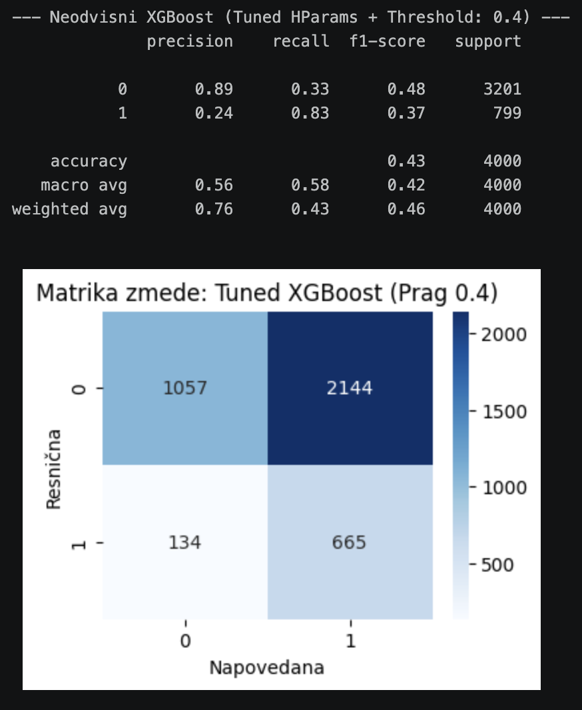
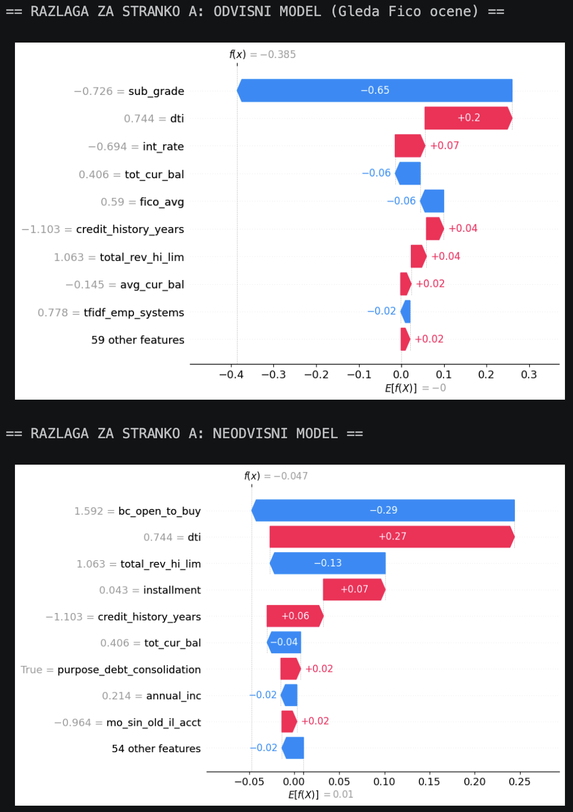
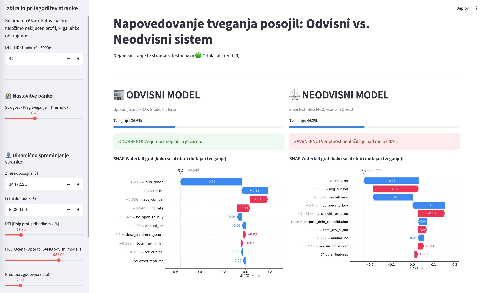

# Poročilo projekta: Napovedovanje tveganja posojil in neodvisno ocenjevanje

## 1. Opis problema

V finančni industriji je ena izmed najpomembnejših odločitev ocena kreditne sposobnosti posameznika. Tradicionalni bančni sistemi se pri ocenjevanju tveganja pogosto zanašajo na notranje bančne ocene in bonitetne metrike, kot so FICO ocena, pripisani *Grade* in obrestna mera (*Int Rate*). Te metrike lahko delujejo skoraj kot samouresničujoča se napoved – stranka z nizko oceno namreč samodejno dobi visoko obrestno mero, zaradi česar v praksi težje odplačuje dolg.

Glavni cilj tega projekta je bil izgraditi dva vzporedna strojna modela in ovrednotiti razliko med njima:
1. **Odvisni model:** Standardni model, ki za napovedovanje uporablja vse razpoložljive atribute, vključno s FICO oceno in bančnimi bonitetami.
2. **Neodvisni model:** Inovativni model, "slepi test", iz katerega smo namerno izključili vse umetno generirane bančne ocene o tveganju (FICO, razredi, obresti). S tem model odloča zgolj in samo na podlagi surovih, osnovnih lastnosti in obnašanja stranke (letni dohodek, DTI - razmerje med dolgom in prihodki, kreditna zgodovina in namen posojila). 

Na ta način smo poskušali odgovoriti na vprašanje: *Ali lahko modeli strojnega učenja samostojno prepoznavajo tveganje neplačila zgolj na podlagi osnovnih lastnosti klienta, ne da bi se zanašali na vnaprej določene interne bančne ocene?*

## 2. Podatki

Za projekt smo uporabili obsežen odprtokodni nabor podatkov **Lending Club**, ki vsebuje zgodovinske podatke o izdanih posojilih in njihovih dejanskih statusih odplačevanja (uporabljen nabor: `accepted_2007_to_2018Q4.csv`, delno vzorčen na 20.000 zapisov v `lending_club_20k.csv` zaradi sistemskih obremenitev). 

Procesiranje podatkov (na voljo v zvezku `01_eda_preprocessing.ipynb`) je vsebovalo:
- **Konstrukcijo ciljne spremenljivke:** Pripravili smo binarno klasifikacijsko oznako `loan_status` (Odplačano = 0, Neplačnik/Bankrot = 1).
- **Čiščenje:** Odstranjeni so bili manjkajoči vpisi ter atributi, ki pronicajo informacije iz prihodnosti (data leakage) in so na voljo šele po odobritvi posojila.
- **Skaliranje:** Vse zvezne numerične vrednosti (dohodki, posojila, itd.) so bile standardizirane s pomočjo `StandardScaler`, originalni uteži skaliranja pa shranjeni (`scaler.pkl`), da jih kasneje uporabimo v produkciji.
- **Končna oblika:** Podatkovno bazo smo razdelili na učno in testno množico in jo izvozili v datoteke `train_final.csv` in `test_final.csv`. Končni nabor je sestavljen iz 68 atributov.

## 3. Izvedene analize in modeliranje

Projekt smo razdelili na več korakov, ki so dokumentirani v datotekah (Jupyter zvezkih), od predobdelave do nenadzorovanega učenja ter obdelave naravnega jezika.

### 3.1 Unsupervised algoritem (Clustering) in NLP analiza

V zvezku `02_pattern_mining.ipynb` smo podatke grupirali z algoritmom K-Means, s katerim smo iskali poskušali poiskati naravne skupine ('risk clusters') med strankami. Zanimalo nas je, ali strojno iskanje vzorcev samodejno razdeli ljudi na rizične (npr. visok DTI in nizek dohodek) in nerizične.

V zvezku `03_nlp_risk_scoring.ipynb` smo se posvetili obdelavi naravnega jezika iz prostih besedil. S pomočjo TF-IDF metode in modelov za analizo sentimenta smo iz nazivov zaposlitev ter opisov namenov posojil izluščili značilke. V obliki novih spremenljivk (npr. `tfidf_emp_manager`, `desc_sentiment_score`) smo te podatke vpeljali v glavni model. S tem smo želeli preveriti, ali obstaja razlika med izbiro besed ob prijavi pri neplačnikih v primerjavi s tistimi, ki kredit normalno odplačajo.

### 3.2 Modeli (Odvisni proti Neodvisnem)

Tekom zvezkov `04_modeling.ipynb` in `04b_independent_modeling.ipynb` je potekalo intenzivno strojno učenje. Primerjali smo algoritma **Logistična Regresija** in **XGBoost (eXtreme Gradient Boosting)**.

**Odvisni model:**  
Ker je model uporabljal `fico_avg`, je imel predvidoma že na začetku zelo močno osnovo za odločanje. Bankrot oziroma neplačilo je zanesljivo napovedoval že pri povsem klasičnem pragom (Threshold) $0.50$. XGBoost se je na teh podatkih odrezal zelo dobro in hkrati prehitel logistično regresijo, zato smo nadaljevali predvsem z njim.

**Neodvisni model:**  
Pri tem modelu smo namenoma izbrisali stolpce `fico_avg`, `grade`, `sub_grade` in `int_rate`, da bi simulirali "slepi test". Pri privzetem pragu 0.5 je bil priklic (Recall) zgolj 50-odstoten. To pomeni, da je sistem v praksi spustil skozi preveliko število neplačnikov. Pokazalo se je, da brez usmerjevalne ocene (FICO) model potrebuje nekoliko drugačno obravnavo.

**Rešitev:** Da bi to težavo omilili, smo optimizirali odločitveni prag, ki smo ga znižali na bolj konzervativno vrednost `0.40`. Hkrati smo pri XGBoost modelu poskrbeli za močnejšo regularizacijo (nastavili smo `max_depth=3`, `subsample=0.8`). Z manjšim pragom smo model prisilili k večji previdnosti. Priklic (Recall) se je bistveno izboljšal, saj je model po optimizaciji uspešno prepoznal in ustavil občutno večji delež dejanskih neplačnikov.

*Slika 1: Matrika zmede neodvisnega modela XGBoost po znižanju praga na 0.40, ki kaže na izboljšano prepoznavanje slabih strank.*

### 3.3 Razložljivost modelov s SHAP

Ker modeli strojnega učenja pogosto delujejo kot "črne škatle", kar pa je v finančni sferi posebej problematično, smo za razložljivost modelov uporabili knjižnico **SHAP (SHapley Additive exPlanations)** (zvezek `05_explainability.ipynb`). Za interpretacijo smo izbrali tako imenovan slap grafični prikaz (*Waterfall plot*). Na ta način lahko dokaj nazorno vidimo, kaj vpliva na posamezno odločitev:
- **Rdeči vrstici** pomenijo, da je določen atribut povečal verjetnost neplačila (porivanje proti vrednosti 1). 
- **Modri vrstici** delujejo obratno in predstavljajo elemente, zaradi katerih je stranka ocenjena za manjšo tveganje.

*Slika 2: Analiza posamezne odločitve s SHAP Waterfall vizualizacijo.*

Tako bi lahko zaposleni v banki precej strokovno stranki razložil, zakaj je bil kredit potencialno zavrnjen.

## 4. Glavni rezultati in Aplikacija za odločevalce

Za boljši prikaz delovanja obeh modelov v praksi nismo ostali zgolj pri izpisu številk v tabelah, temveč smo pripravili programsko rešitev. Kljub temu, da je Neodvisni model prikrajšan za uradne bančne podatke, se dobro znajde pri uporabi ostalih informacij s fokusom na DTI in NLP metriko.

### Bančna nadzorna aplikacija v živo (Streamlit)
Za končno predstavitev rezultatov smo zgradili uporabniku prijazno aplikacijo (`app.py`), ki služi kot interaktivna nadzorna plošča hipotetičnemu referentu:
1. **Primerjalni pogled:** Aplikacija neposredno eno ob drugi poganja Odvisni in Neodvisni XGBoost model na isti izbrani stranki, s čimer si referent lahko sam ustvari mnenje.
2. **Razumljive vhodne vrednosti:** Da aplikacija ni preveč abstraktna, smo omogočili vnos vrednosti v standardnih merah (vnos v dolarjih ali običajni FICO skali). Zaledje model predikcij samo poskrbi za ponovno *z-score* standardizacijo, ki jo pričakuje model XGBoost.
3. **Analiza "Kaj če":** Uporabnik lahko interaktivno spreminja vhodne podatke (npr. zviša DTI) in opazuje grafe ter model v živo.
4. **Zgodovina simulacij:** Spremembe in poizvedbe se shranjujejo v tabelo na dnu zaslona.

*Slika 3: Grafični vmesnik končne aplikacije "Lending Risk Evaluator" s sočasno primerjavo odvisnega in neodvisnega pristopa.*

**Zaključek:**  
Rezultati potrjujejo, da so interne bančne ocene logično zelo močan napovednik tveganja. Kljub temu smo ugotovili, da je ob vključitvi obdelave naravnega jezika (NLP), znižanju praga ter pozornosti na zadolžitve (DTI) mogoče ustvariti nevtralnejši mehanizem za zavračanje najbolj kritičnega roba prosilcev. Morda je v prihodnosti prav uporaba tovrstnih modelov brez umetnih bančnih ocen prava pot k bolj transparentnemu in neodvisnemu ocenjevanju.

---
*Za izris izvedenih SHAP grafov, vpogled v NLP besede ter celotno interaktivno izkušnjo predlagamo zagon aplikacije pod modulom Streamlit (`streamlit run app.py`).*
