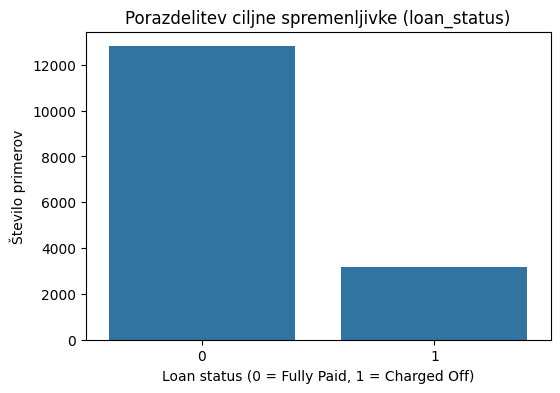
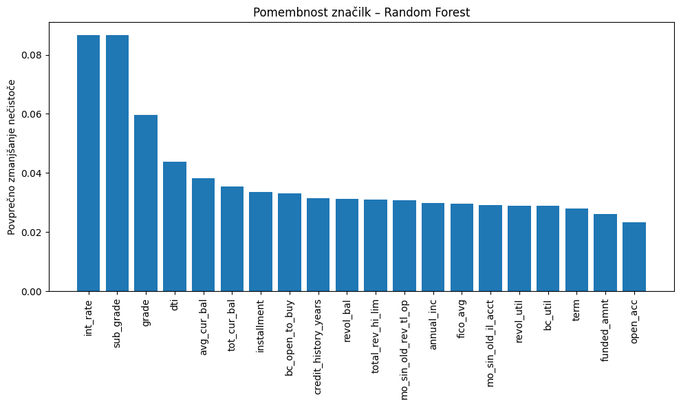
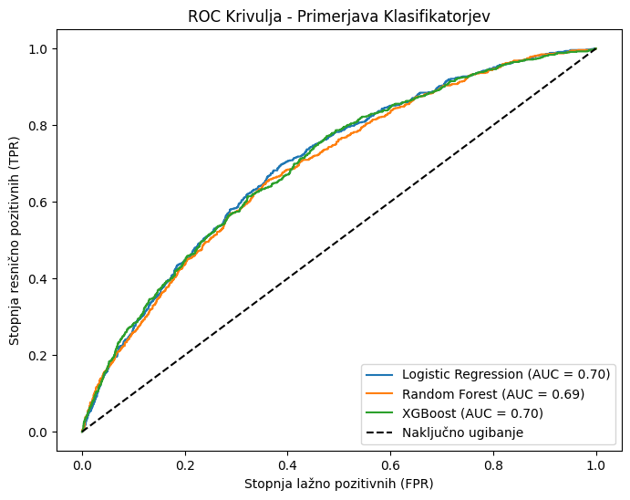

# Vmesno poročilo: Napovedovanje neplačila posojil s strojnim učenjem

## 1. Opis problema in cilji
Cilj našega projekta je razviti zanesljiv napovedni model za ocenjevanje tveganja neplačila posojil (ang. *default prediction*). Finančne institucije pri izdaji kreditov prevzemajo tveganje, da posojilojemalec svojih obveznosti ne bo poravnal. Z uporabo algoritmov strojnega učenja želimo na podlagi zgodovinskih in demografskih podatkov posojilojemalcev vnaprej prepoznati tvegane profile. Problem smo definirali kot binarno klasifikacijo z močno asimetrično porazdelitvijo, kjer razred `0` predstavlja uspešno poplačilo, razred `1` pa neplačilo (izpad, *Charged Off*).

## 2. Podatki in priprava
Kot osnovo smo uporabili obsežno zbirko podatkov »Lending Club« (2007–2018). Zaradi računske zahtevnosti smo iz izhodiščnega nabora izvedli stratificirano vzorčenje natanko 20.000 vrstic, pri čemer smo ohranili izvirno razmerje v ciljni spremenljivki (stopnja neplačil v našem vzorcu je približno 20 %).

* **Izbira in čiščenje:** Izmed več kot 140 atributov smo obdržali okrog 40 najrelevantnejših (npr. znesek posojila, obrestna mera, DTI – razmerje dolga proti dohodku, letni dohodek, namen posojila).
* **Manjkajoče vrednosti in skaliranje:** Na učni in testni množici smo sistematično imputirali manjkajoče vrednosti. Številske atribute smo standardizirali, kategorične pa kodirali s tehniko One-Hot Encoding, pri čemer smo pazili, da preprečimo prehajanje informacij (ang. *data leakage*) med učnim in testnim naborom.

## 3. Glavne ugotovitve raziskovalne analize (EDA) in iskanje vzorcev
Podatke smo grafično in globinsko raziskali ter odkrili pomembne korelacije:
1. **Obrestne mere in DTI:** Posojilojemalci z višjimi obrestnimi merami in višjim razmerjem dolga proti dohodku (DTI) imajo statistično znatno večjo verjetnost za neplačilo.
2. **Asociacijska pravila:** S pomočjo algoritma *Apriori* smo kategorične atribute preverili v obliki trditev (z nastavitvijo *min_support=0.05* in *lift > 1*). Odkrili smo, da prevladujoči profil **neplačnika** sestavljajo atributi: visoka obrestna mera, status najemnika (nima lastniške nepremičnine) in posojilo, vzeto za namen konsolidacije dolgov (Debt Consolidation).

Da bi okrnili šum in izboljšali performanse, smo izvedli **izbiro značilk z naključnim gozdom**. Gozd je najbolj poudaril značilke: `sub_grade`, `int_rate`, `dti`, `avg_cur_bal` ter kredito oceno (`fico_avg`). S tem smo obdržali top 15 atributov, ki sami pojasnijo 95 % variance targeta.

## 4. Dodajanje vrednosti iz besedil – Ocenjevanje NLP (Faza 3)
Podatki niso le numerični. Kreditojemalci običajno vpišejo opis namena ali naziv delovnega mesta. Izvedli smo analizo s pristopom TF-IDF (in potencialno analizo sentimenta), da bi ključne besede preoblikovali v numerične vektorje. Ugotovili smo, da določeni izrazi ali pomanjkljivi opisi pri posojilih rahlo korelirajo z višjim finančnim tveganjem. Modeliranje je s pomočjo teh obdelanih tekstovnih stolpcev pridobilo dodatno (sicer subtilno) dimenzijo ločevanja.

## 5. Modeliranje in najzanimivejši rezultati (Faza 4)
Pred samim klasificiranjem smo z metodo **K-Means** (K=3, na podlagi *Elbow* in silhuetne metode) podatke segmentirali in uvedli dodatno gručeno značilko »`risk_cluster`«, s katero smo algoritmom dali predikcijski namig osnovnih profilov.

Nato smo reševali problem binarne klasifikacije. Izziv 20-odstotne zastopanosti pozitivnega razreda smo napadli z asimetričnim uteževanjem razredov (`class_weight='balanced'` in `scale_pos_weight`). Primerjali smo 3 paradigme:
- **Logistična regresija**
- **Naključni gozd (Random Forest)**
- **XGBoost Classifier**

**Najbolj presenetljiv rezultat:** 
Kljub temu, da *XGBoost* velja za vrhunski model obvladovanja tabularnih podatkov, je za naš optimiziran 20-tisoč-vrstični vzorec in izbrane komponente presenetljivo **Logistična regresija dosegla najboljše in najkoristnejše metrične vrednosti**:
* Logistična regresija je dosegla AUC okoli **0.700**, medtem ko je bil AUC pri XGBoostu praktično identičen (**0.698**). 
* Z vidika poslovne banke nas najbolj zanima **priklic (Recall)** tveganih strank. Logistična regresija je našla **cca. 63.8 %** vseh dejanskih neplačnikov, medtem ko jih je XGBoost okoli 60.6 %, Random Forest pa celo pod 50 %.

### Interpretacija ugotovitev
Razlog za tak razpon tiči v naravi podatkovne mize – predprocesiranje, skrbno *Apriori* in *RF Feature Selection* sejanje in NLP prečiščevanje so stvorili dokaj **linearno ločljiv prostor značilk**. Kjer odločitveni gozdovi pogosto ustvarijo prepodrobne drevesne meje, se Logistična regresija s čisto linearno hiperravnino elegantno odzove na finančne indikatorje.

## 6. Zaključek
V prvem delu projekta smo uspešno vzpostavili stabilen podatkovni cevovod (pipeline), potrdili intuitivna pravila neplačil (visok *DTI*, najemniki) ter presenetili s spoznanjem, da visoko interpretabilni modeli (Logistična Regresija) parirajo hiperkompleksnim (XGBoost). V sklopu projekta smo izvozili **oba modela**, kar nam daje prožnost: robustno regresijo za hitro in tolmačeno uporabo API-ja na srednjem volumnu podatkov in globok XGBoost, če projekt skaliramo na milijone instanc in ne-linearnih povezav.
